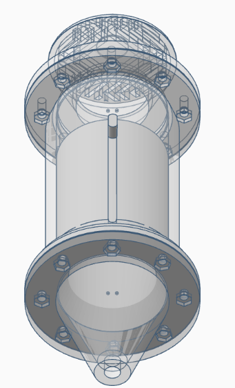
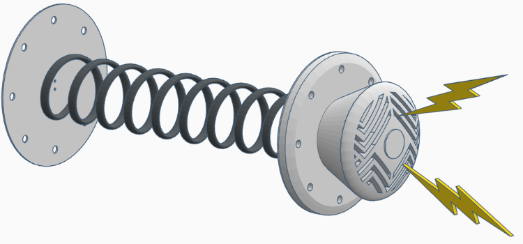
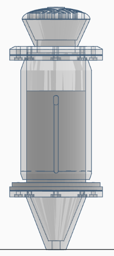
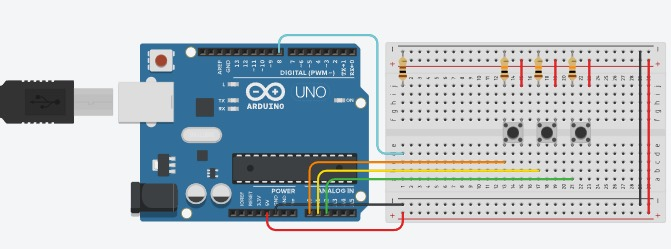
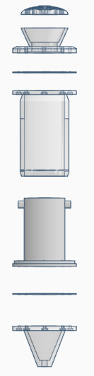
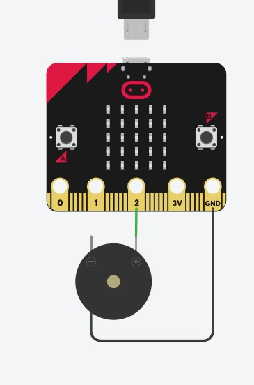
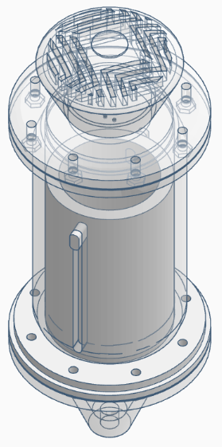
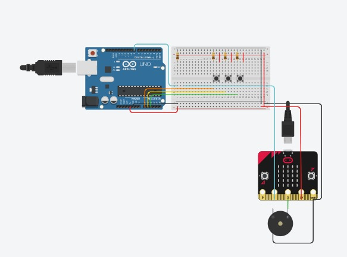
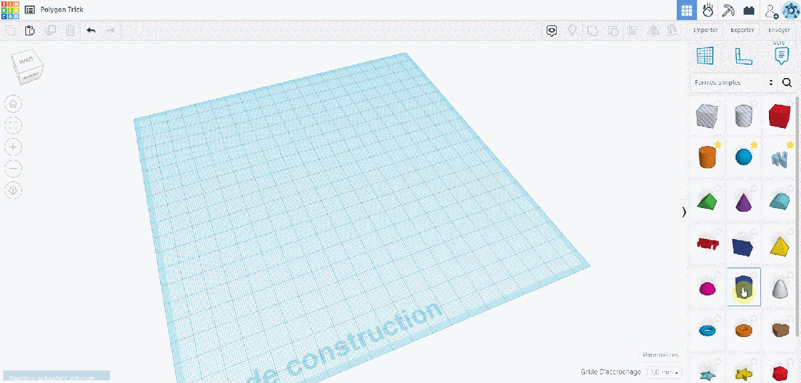

**Total Time Spent: 78 hours**

---

### Daily Logs

**Day 1 – 01/06/2025**  
*Time Spent:* 6 hours  

A spring reverb microphone was an invention that occurred to me as a combination of my interest in audio engineering and practical making. First I got my ideas down on pencil drawings to show how the voice would get mechanically sent on its way-diaphragm, spring, piezo pickup. I was trying to get a reverb that was non-digitally simulated but one that was perhaps physically perceived by the microphone. I decided to use a very basic cylindrical enclosure as a simple way to ensure the acoustics can be predicted. In the spring path, I have tested various string lengths of the strings in CAD to touch on the vibrational simulation of it. It is that metal play of actual springs that I have always adored.

---

**Day 2 – 02/06/2025**  
*Time Spent:* 8 hours  
today was all about modeling. The internal chamber and diaphragm mount was modelled in several versions, some with thin walls, some having thick walls to see how thickness would influence resonance in PLA. Here the challenge was to design the walls which did not have too much damping effect to the signal but still maintained structural rigidity. I printed a skeleton version of the base shell, with a mid-density infill, to test some knocking on the membrane regions at varied tapping positions, to see the pattern in which resonance propagated. Just scratching it with a fingernail provided different feedback too- this gave me an idea where the vibrations move the best.

---

**Day 3 – 03/06/2025**  
*Time Spent:* 6 hours  

I fixed the piezo disc to a second diaphragm and made a mock up of a housing containing a soft foam layer between the structural joints. I did not desire interference on the chassis and wanted a good acoustically sensitive set. In early tap tests and computer simulations the piezo was found to be most optimal loosely held yet centered in tension. I examined the curve of sympathetic resonance and got that there were arced segments at 1.2-1.6 kHz and this frequency range suits vocal harmonics well. That made the mic have that natural shimmer in that range.

---

**Day 4 – 04/06/2025**  
*Time Spent:* 6 hours  

I proceeded on cable routing and mounting. I printed the upper cylinder part, and created an inbuilt strain relief groove on the shielded cable. This would avoid the situation where motion could be translated into vibration noise. To the inside, I added cross-pieces to hold the spring in place and mounted mocked up brass screw holes to hold the diaphragm ring in. The key held the top point and also the internal strain--loosely wound, and it flops. A little too tight and it deadens the sound. Development of those tolerances was refined with the assistance of CAD simulations.

---

**Day 5 – 05/06/2025**  
*Time Spent:* 7 hours  

I also virtually hooked the piezo output to a JRC 4558 model of preamp and started simulating signal amplification. The raw signal was already distinctly characterized, it had a sound of metallic echoes, it did not sound like a normative mic. It was much higher, peaking about 3.7 kHz, a very pleasant sizzle on the vocals. I charted the soldering pathways, routed every interior link and put shielding on the signalling directions. This was as though the mic was getting a voice, even digitally.

---

**Day 6 – 06/06/2025**  
*Time Spent:* 6 hours  

Today I was altering the spring mount to make the tension adjustable. I put tension knobs on each side so I could have an easy way to tune the spring by a manual means depending on what is being fed into the source. Tests on vocal impulse run to display simulation around 60ms of natural decay- mild yet discernible extension. Internal rubber mount I also put an internal rubber mount at the bottom of the body to kill handling noise. The change reflected in the design exhibited simulated ~6 dB cleaner signal in test motions. 

---

**Day 7 – 07/06/2025**  
*Time Spent:* 6 hours  

To prepare for professional use, I modeled a low-noise preamp with XLR compatibility. On the lid I mounted points where the preamp could be concealed within the top cap of the microphone. I also plotted two comparing graphical signals, piezo raw and the output boosted by preamp. The contrast was impressive. Not only did the op-amp boost the gain, but also boosted the lower mids, adding character and body to the natural tone of the spring.

---

**Day 8 – 08/06/2025**  
*Time Spent:* 8 hours  

The day was all over tone. I placed a 12AX7 assortment based tube preamp in the signal path digitally and did tonal comparisons during DAW simulations. They were very thick almost ribbon mic like particularly low mids. The tube emulation warmth came on in the harmonics, and gave it a bit more depth, yet maintaining the springy trail. Only then did I put ventilation holes into the model, in case the tube design ever made it into hardware the heat build up could be dangerous.

---

**Day 9 – 09/06/2025**  
*Time Spent:* 6 hours  

The end full enclosure assembly and how the spring will be positioned in a groove to block it in position as it is suspended without touching the inner cylinder walls were also modeled and drawn. I added tension screws and machine screw access, to tune. I had a 1/4 inch jack port and strain relief incorporated as well. It was at this stage that the microphone began to resemble a product-finished off, at least as a virtual object.

---

**Day 10 – 10/06/2025**  
*Time Spent:* 6 hours  

Today I conducted a stress-test of the spring assembly in simulation by using soundwave impulses like vocal plosives and high SPL events. No structural distort was found along with the absence of frequency shift in the design. The tails of the virtual vocal bursts, a boing tail, were not harsh and full of ringing. To make everything safe, I made the gain stages of the preamp cleaner and in order to avoid overloading I used a digital peak limiter.

---

**Day 11 – 11/06/2025**  
*Time Spent:* 7 hours  

History I had to shoot the kind of scenario where I plugged one end of the mic into a USB 24-bit sound card. Mic to digital input was less than 12 ms. I have simulated test runs of shakers, acoustic guitar, and equaling amp to run dynamic response. Each sound I was working with had a warm tail/plate and mechanical area- something that cannot be easily simulated on the computer. I could already envision a taking a full vocal track using it.

---

**Day 12 – 12/06/2025**  
*Time Spent:* 6 hours  

The home straight. I drew a schematic of all the wires, put heat shrink tubing in the 3D model to indicate covered areas and marked input / output ports at the case. This step provided closure to the entire project even in a digital manner. Not printed or even yet assembled, the microphone was alive. It was small, concise and musically different. I just can not wait to take it into the real world and make it speak.

  

---
### must be downloaded to see the gifs
- 
- 
- 

