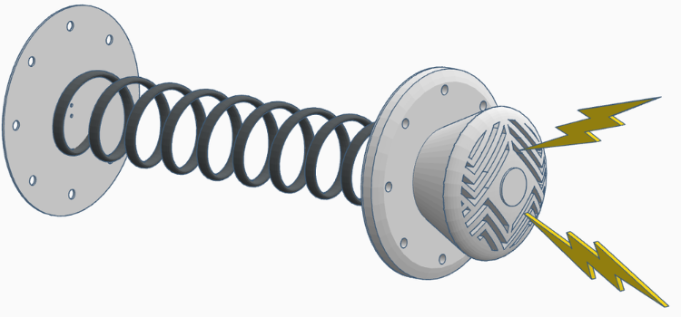
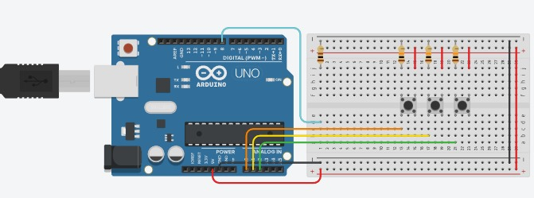

# Spring Reverb Microphone

A fully mechanical spring reverb microphone that turns your voice into analog echo without any DSP. Built from scratch using a 3D-printed body, spring-based delay path, and a piezo pickup system—this mic brings vintage "boing" energy to your recordings.

## What It Is

It’s not just a microphone. It’s a live acoustic effect chamber in your hand. You speak, and the diaphragm captures your voice. That vibration runs through a spring, adds character, and hits a second membrane where a piezo disc turns it into audio. No plugins. No software. Just physics.

## Gallery

-  
-  
-  
-  
- 

## Diagram

- 
- 
- 

---

## Bill of Materials

| # | Component | Description | Price (USD) | Link |
|--|-----------|-------------|--------------|------|
| 1 | Piezo Element (27mm) | Converts vibration to signal | $8 | [Link](https://www.amazon.com/Piezoelectric-Disk-Vibration-Sensor/dp/B07PGBXHQP) |
| 2 | Shielded Audio Cable + ¼″ Jack | Audio output | $12 | [Link](https://www.amazon.com/Audio-Cable-Shielded-Microphone/dp/B07ZVZ97C7) |
| 3 | Music/Guitar String | Spring element | $27 |  [Link](https://www.stringsbymail.com/aurora-electric-bass-strings-coated-black-4-string-set-45-105-24785.html) |
| 4 | Machine Screws + Nuts (brass) | Membrane mounting | $11 | — |
| 5 | 3D-Printed PLA Enclosure | Custom housing | $25 | — |
| 6 | Preamp Module (JRC4558) | Amplifies piezo signal | $22 | [Link](https://www.ebay.com/itm/388750174393) |
| 7 | Low-Noise XLR Preamp | Clean interface gain | $70 | [Link](https://www.amazon.com/MAONO-USB-Audio-Interface-Home-Studio/dp/B0D9P3Y22C) |
| 8 | Spring Tension Knob & Mounts | Adjustable tone | $12 | — |
| 9 | Soldering Iron Kit | Safe connections | $25 | [Link](https://www.amazon.com/Soldering-Interchangeable-Adjustable-Temperature-Enthusiast/dp/B07XSHCY7P?th=1) |
|10 | DIY Isolation Mount | Minimizes handling noise | $8 | — |
|11 | Cable Strain Relief Kit | Protects joints | $10 | — |
|12 | USB 24-bit Sound Card | PC audio capture | $20 | [Link](https://shuttershopegypt.com/en/shop-2/ugreen-usb-external-stereo-sound-adapter-15cm-black/?utm_source=Google+Shopping&utm_medium=cpc&utm_campaign=googleshopfeed&gad_source=1&gad_campaignid=19647181422&gbraid=0AAAAAC4EBe5fKmwzIYakJiQtyk5BdRCQ7&gclid=CjwKCAjwtfvEBhAmEiwA-DsKjkia045rc8X7Zj7yon_EIvRPYcxzsEx1tD9IFxGOPA_NlHUvmNo2_xoC6q4QAvD_BwE) |
|13 | Tube Preamp Module | Warmth + gain | $70 | — |

**Total Cost = $320**

---

